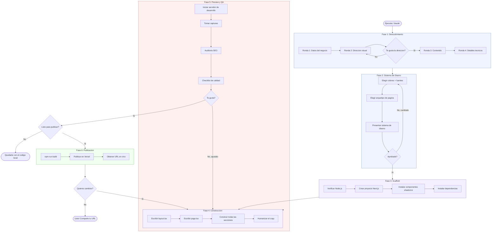

> **[Read this in English (README.md)](README.md)**

# Claude Web Builder

Construye una pagina web profesional en minutos. No necesitas saber programar.

Clona este proyecto, abrelo con Claude Code, responde unas preguntas sobre tu negocio, y Claude disena, construye, te muestra y publica tu pagina.

---

## Que Obtienes

Cuando termines, vas a tener:
- Una **pagina de inicio personalizada** hecha a tu medida (no es una plantilla generica)
- **Diseno profesional** que no se ve como si lo hubiera hecho una IA (evitamos eso a proposito)
- **Layout responsivo** que funciona en celulares, tablets y computadoras
- **SEO optimizado** con meta tags para que Google te encuentre
- **Una URL en vivo** que puedes compartir con quien quieras (publicada en Vercel, gratis)

La pagina se construye con Next.js, Tailwind CSS y shadcn/ui — herramientas modernas que usan los desarrolladores profesionales.

---

## Inicio Rapido (Paso a Paso)

### Paso 1: Instala Claude Code

Claude Code es una herramienta de linea de comandos de Anthropic. La necesitas para correr este proyecto.

**Instalala:**
```bash
npm install -g @anthropic-ai/claude-code
```

Si no tienes `npm`, instala Node.js primero (ve el Paso 2).

Despues de instalar, puede que necesites iniciar sesion:
```bash
claude login
```

### Paso 2: Instala Node.js

Node.js es una herramienta que ejecuta JavaScript en tu computadora. La pagina la necesita para construirse.

**Revisa si ya lo tienes:**
```bash
node --version
```

Si ves `v18.0.0` o superior, estas bien. Si no:

- **Mac:** Ve a [nodejs.org](https://nodejs.org), descarga la version **LTS**, abre el archivo y sigue el instalador.
- **Windows:** Igual — [nodejs.org](https://nodejs.org), descarga LTS, corre el instalador.
- **Linux:** `sudo apt install nodejs npm` (Ubuntu/Debian) o revisa [nodejs.org](https://nodejs.org/en/download) para tu distro.

### Paso 3: Clona este proyecto

"Clonar" significa descargar una copia de este proyecto a tu computadora.

**Abre tu terminal** (Mac: busca "Terminal" en Spotlight. Windows: busca "Simbolo del sistema" o "PowerShell").

Luego corre:
```bash
git clone https://github.com/Hainrixz/claude-webkit.git
cd claude-webkit
```

Ahora tienes el proyecto en tu computadora dentro de una carpeta llamada `claude-webkit`.

### Paso 4: Inicia Claude

Dentro de la carpeta del proyecto, corre:
```bash
claude
```

Claude va a leer las instrucciones del proyecto y te va a saludar. Ya sabe que su trabajo es ayudarte a construir una pagina web.

### Paso 5: Responde las preguntas

Claude te va a preguntar sobre tu negocio en 4 rondas cortas:

1. **Lo basico** — El nombre de tu negocio, a que se dedican, quien es tu audiencia
2. **El look** — Colores, estilo, que onda quieres (o dile "tu decide" y Claude elige por ti)
3. **El contenido** — Que quieres que hagan los visitantes, servicios clave, eslogan
4. **Lo tecnico** — Logo, imagenes, si quieres publicar la pagina

**No sabes la respuesta?** Solo di "tu decide" o "no estoy seguro" y Claude va a tomar una buena decision por ti.

### Paso 6: Ve como Claude construye

Despues de que apruebes el plan, Claude:
1. Configura el proyecto (toma como 30 segundos)
2. Construye cada seccion de tu pagina
3. Te da actualizaciones mientras trabaja

No necesitas hacer nada en este paso — solo observa.

### Paso 7: Ve tu pagina

Claude va a:
- Mostrarte capturas de pantalla (si tiene el skill de Playwright instalado)
- O decirte que abras `http://localhost:3000` en tu navegador

Abre ese link y vas a ver tu pagina corriendo en tu computadora.

Claude te va a pedir feedback: "Que te parece la seccion principal?" Dile que te gusta y que quieres cambiar. Va a iterar hasta que estes contento.

### Paso 8: Publica (opcional)

Cuando estes contento con la pagina, Claude te va a preguntar si quieres publicarla.

Si dices que si:
- Claude corre el script de deploy (incluido — **no necesitas cuenta de Vercel**)
- Te da una **URL en vivo** como `https://tu-sitio-abc123.vercel.app`
- Puedes compartir esta URL con quien quieras — funciona en cualquier dispositivo
- Tambien te da una **URL de reclamo** si quieres conservar el sitio permanentemente (cuenta gratis de Vercel)

### Paso 9: Listo!

Ahora tienes:
- Una pagina en vivo en tu URL de Vercel
- El codigo fuente en la carpeta `site/` en tu computadora
- Propiedad total — puedes editar lo que quieras, cuando quieras

---

## Requisitos

| Que | Para que | Como conseguirlo |
|-----|----------|-----------------|
| **Claude Code** | Corre este proyecto | `npm install -g @anthropic-ai/claude-code` |
| **Node.js 18+** | Construye la pagina | [nodejs.org](https://nodejs.org) — descarga LTS |
| **Git** | Descarga este proyecto | Generalmente viene preinstalado. [git-scm.com](https://git-scm.com) si no |
| **Cuenta de Vercel** (opcional) | Publica en una URL en vivo | Gratis en [vercel.com](https://vercel.com) |

---

## Skills Incluidos

Este proyecto viene con **13 skills profesionales pre-instalados** en `.claude/skills/`. Se cargan automaticamente cuando Claude abre el proyecto — no necesitas instalar nada extra.

| Skill | Que hace |
|-------|---------|
| `frontend-design` | Metodologia de diseno para que los disenos se vean profesionales, no generados por IA |
| `shadcn-ui` | Guia de componentes para UI pulida con accesibilidad incluida |
| `humanizer` | Quita patrones de escritura IA para que el texto suene humano |
| `vercel-react-best-practices` | 62 reglas de rendimiento para tiempos de carga mas rapidos |
| `vercel-deploy` | **Publica en Vercel al instante — sin necesidad de cuenta.** Detecta el framework y te da una URL en vivo |
| `building-components` | Guia para construir componentes de UI modernos y accesibles |
| `web-design-guidelines` | Revisa tu pagina contra las guias de Web Interface de Vercel |
| `playwright-cli` | Automatizacion de navegador para que Claude tome capturas y revise el diseno |
| `chrome-bridge-automation` | Navegador de respaldo — se conecta a tu Chrome para revisar el diseno visualmente |
| `seo-audit` | Analisis SEO para meta tags, encabezados y visibilidad en buscadores |
| `ui-ux-pro-max` | Base de datos de inteligencia de diseno — 161 paletas de colores, 57 pares de fuentes, 50+ estilos |
| `web-reader` | Analiza sitios web de referencia que le gusten al usuario |
| `deep-research` | Investigacion web sistematica para mejor copy especifico de la industria |

---

<details>
<summary><strong>Preguntas Frecuentes</strong></summary>

### Necesito saber programar?
**No.** Claude se encarga de todo el codigo. Tu solo respondes preguntas sobre tu negocio y das feedback sobre el diseno.

### Es gratis?
**Casi todo.** Necesitas una suscripcion a Claude Code (de Anthropic). Node.js, Git y el deploy son todos gratis. Ni siquiera necesitas cuenta de Vercel — el script de deploy incluido se encarga de todo.

### Puedo editar la pagina despues de que Claude la construya?
**Si.** El codigo fuente esta en la carpeta `site/`. Es codigo estandar de Next.js + React. Tu (o cualquier desarrollador) puede editarlo cuando quiera.

### Que pasa si no me gusta el diseno?
**Dile a Claude.** Di algo especifico como "los colores se sienten muy frios" o "haz el titulo mas grande." Claude itera hasta que estes contento. Tambien puedes empezar de cero corriendo el proyecto otra vez.

### Puedo usar mi propio dominio (como minegocio.com)?
**Si.** Despues de publicar en Vercel, ve a tu dashboard de Vercel, haz clic en el proyecto, ve a "Domains" y agrega tu dominio personalizado. Necesitaras actualizar la configuracion DNS (Vercel te da las instrucciones).

### Puedo construir mas de una pagina?
**Si.** Cada vez que corres el proyecto, Claude construye una pagina nueva dentro de la carpeta `site/`. Puedes renombrar la carpeta y empezar de nuevo para un proyecto diferente.

### La pagina funciona en celulares?
**Si.** Cada pagina se construye mobile-first. Esta disenada para 375px (celular), 768px (tablet), 1024px (laptop) y 1440px (escritorio).

### En que idioma puede estar la pagina?
**En cualquier idioma.** Solo dile a Claude en que idioma quieres el contenido de la pagina. La interfaz soporta ingles y espanol nativamente, pero el contenido puede ser en cualquier idioma.

</details>

---

<details>
<summary><strong>Solucion de Problemas</strong></summary>

### "command not found: claude"
Claude Code no esta instalado. Corre: `npm install -g @anthropic-ai/claude-code`

### "command not found: node"
Node.js no esta instalado. Descargalo de [nodejs.org](https://nodejs.org).

### "command not found: git"
Git no esta instalado. Descargalo de [git-scm.com](https://git-scm.com).

### La pagina no carga en localhost:3000
- Revisa que el servidor este corriendo (deberias ver output en la terminal)
- Prueba otro puerto: `npm run dev -- --port 3001`
- Asegurate de que nada mas este usando el puerto 3000

### El deploy a Vercel falla
- Corre `npx vercel login` para autenticarte
- Asegurate de que `npm run build` funcione localmente primero (arregla errores antes de publicar)
- Revisa tu conexion a internet

### Claude parece atorado o confundido
- Prueba diciendo "vamos a empezar el cuestionario desde el principio"
- O cierra Claude y corre `claude` otra vez en la carpeta del proyecto

</details>

---

## Como Funciona

El archivo `CLAUDE.md` tiene instrucciones que convierten a Claude Code en un asistente guiado para construir paginas web. Cuando Claude abre este proyecto, lee esas instrucciones y te lleva por 6 fases — desde preguntas hasta una URL en vivo.

### Mapa del Flujo



**Puntos de decision (donde Claude te pregunta):**
- Despues de la Ronda 2 — "Te gusta esta direccion de diseno?"
- Despues de la Fase 5 — "Como se ve?" (da feedback para iterar)
- Antes de la Fase 6 — "Listo para publicar?"

**Todo lo demas es automatico.** Las Fases 3-4 corren sin preguntar — Claude construye y te muestra el resultado.

## Stack Tecnologico

- Next.js 15+ (App Router)
- Tailwind CSS 4
- shadcn/ui
- TypeScript
- Framer Motion

## Estructura del Proyecto

```
claude-webkit/
├── CLAUDE.md                        # Instrucciones para Claude (el cerebro)
├── .claude/
│   ├── settings.local.json          # Permisos de herramientas
│   └── skills/                      # 13 skills incluidos (se cargan solos)
│       ├── frontend-design/         # Metodologia de diseno + 7 docs de referencia
│       ├── shadcn-ui/               # Guia de componentes
│       ├── humanizer/               # Eliminacion de patrones IA
│       ├── vercel-react-best-practices/  # 62 reglas de rendimiento
│       ├── vercel-deploy/           # Deploy sandbox (sin cuenta necesaria)
│       ├── building-components/     # Patrones de componentes accesibles
│       ├── web-design-guidelines/   # Guias de Vercel Web Interface
│       ├── playwright-cli/          # Automatizacion de navegador + 7 referencias
│       ├── chrome-bridge-automation/ # QA visual con Chrome (respaldo)
│       ├── seo-audit/              # Analisis SEO + referencias
│       ├── ui-ux-pro-max/          # Base de datos de inteligencia de diseno (161 paletas, 57 fuentes)
│       ├── web-reader/             # Extraccion de contenido web para sitios de referencia
│       └── deep-research/          # Investigacion web sistematica
├── docs/
│   ├── system-prompt.md             # Personalidad del agente (ingles)
│   ├── system-prompt-es.md          # Personalidad del agente (espanol)
│   ├── questionnaire.md             # Preguntas guiadas (ingles)
│   ├── questionnaire-es.md          # Preguntas guiadas (espanol)
│   ├── design-guide.md              # Principios y reglas de diseno
│   ├── landing-page-patterns.md     # 8 arquetipos de paginas
│   ├── performance-checklist.md     # Optimizacion de Core Web Vitals
│   ├── accessibility-checklist.md   # Cumplimiento WCAG AA
│   ├── deployment-guide.md          # Deploy a Vercel
│   ├── skill-reference.md           # Skills y ejemplos de uso
│   └── examples/                    # Briefs de proyectos ejemplo
├── LICENSE                          # Licencia MIT
└── README.md                        # Version en ingles
```

Cuando Claude construye tu pagina, crea un directorio `site/` con el proyecto completo de Next.js.

## Licencia

Licencia MIT — ve [LICENSE](LICENSE)

---

Creado por [@Soyenriquerocha](https://github.com/Soyenriquerocha) / [Tododeia](https://tododeia.com)
