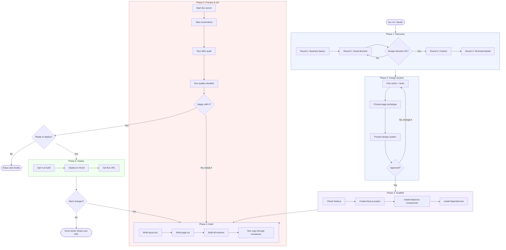

> **[Lee esto en espanol (README.es.md)](README.es.md)**

# Claude Web Builder

Build a professional landing page in minutes. No coding experience needed.

Clone this repo, open it with Claude Code, answer a few questions about your business, and Claude builds, previews, and deploys your page.

---

## What You Get

When you're done, you'll have:
- A **custom landing page** built to your specifications (not a generic template)
- **Professional design** that doesn't look AI-generated (we specifically avoid that)
- **Mobile-responsive** layout that works on phones, tablets, and desktops
- **SEO-optimized** meta tags so search engines can find you
- **A live URL** you can share with anyone (deployed to Vercel for free)

The page is built with Next.js, Tailwind CSS, and shadcn/ui — modern tools used by professional developers.

---

## Quick Start (Step by Step)

### Step 1: Install Claude Code

Claude Code is a command-line tool from Anthropic. You need it to run this project.

**Install it:**
```bash
npm install -g @anthropic-ai/claude-code
```

If you don't have `npm`, install Node.js first (see Step 2).

After installing, you may need to log in:
```bash
claude login
```

### Step 2: Install Node.js

Node.js is a tool that runs JavaScript on your computer. The landing page needs it.

**Check if you already have it:**
```bash
node --version
```

If you see `v18.0.0` or higher, you're good. If not:

- **Mac:** Go to [nodejs.org](https://nodejs.org), download the **LTS** version, open the file, and follow the installer.
- **Windows:** Same — [nodejs.org](https://nodejs.org), download LTS, run the installer.
- **Linux:** `sudo apt install nodejs npm` (Ubuntu/Debian) or check [nodejs.org](https://nodejs.org/en/download) for your distro.

### Step 3: Clone this project

"Cloning" means downloading a copy of this project to your computer.

**Open your terminal** (Mac: search for "Terminal" in Spotlight. Windows: search for "Command Prompt" or "PowerShell").

Then run:
```bash
git clone https://github.com/Hainrixz/claude-webkit.git
cd claude-webkit
```

You now have the project on your computer inside a folder called `claude-webkit`.

### Step 4: Start Claude

Inside the project folder, run:
```bash
claude
```

Claude will read the project instructions and greet you. It knows it's supposed to help you build a landing page.

### Step 5: Answer the questions

Claude will ask you about your business in 4 short rounds:

1. **The basics** — Your business name, what you do, who your audience is
2. **The look** — Colors, style, vibe (or say "you decide" and Claude picks for you)
3. **The content** — What you want visitors to do, key features, tagline
4. **Technical stuff** — Logo, images, whether you want to deploy

**Don't know the answer?** Just say "you decide" or "I'm not sure" and Claude will make a good choice for you.

**Speak Spanish?** Just respond in Spanish and Claude will switch to Spanish for the entire process.

### Step 6: Watch Claude build

After you approve the plan, Claude:
1. Sets up the project (takes about 30 seconds)
2. Builds each section of your page
3. Gives you status updates as it works

You don't need to do anything during this step — just watch.

### Step 7: Preview your page

Claude will either:
- Show you screenshots (if the Playwright skill is installed)
- Tell you to open `http://localhost:3000` in your browser

Open that link and you'll see your landing page running on your computer.

Claude will ask for your feedback: "How does the hero section feel?" Tell it what you like and what to change. It'll iterate until you're happy.

### Step 8: Deploy (optional)

When you're happy with the page, Claude will ask if you want to deploy it.

If you say yes:
- Claude runs the deploy script (bundled — **no Vercel account needed**)
- You get a **live URL** like `https://your-site-abc123.vercel.app`
- You can share this URL with anyone — it works on any device
- You also get a **claim URL** if you want to keep the site permanently (free Vercel account)

### Step 9: You're done!

You now have:
- A live landing page at your Vercel URL
- The source code in the `site/` folder on your computer
- Full ownership — you can edit anything, anytime

---

## Prerequisites

| What | Why | How to Get It |
|------|-----|--------------|
| **Claude Code** | Runs this project | `npm install -g @anthropic-ai/claude-code` |
| **Node.js 18+** | Builds the landing page | [nodejs.org](https://nodejs.org) — download LTS |
| **Git** | Downloads this project | Usually pre-installed. [git-scm.com](https://git-scm.com) if not |
| **Vercel account** (optional) | Only needed to claim/keep deployments permanently | Free at [vercel.com](https://vercel.com) |

---

## Bundled Skills

This project comes with **13 professional skills pre-installed** in `.claude/skills/`. They load automatically when Claude opens the project — you don't need to install anything extra.

| Skill | What It Does |
|-------|-------------|
| `frontend-design` | Design methodology that makes designs look professional, not AI-generated |
| `shadcn-ui` | Component library guide for polished UI with accessibility built in |
| `humanizer` | Removes AI writing patterns so page copy sounds human |
| `vercel-react-best-practices` | 62 performance rules for faster page load times |
| `vercel-deploy` | **Deploy to Vercel instantly — no account needed.** Auto-detects framework and gives you a live URL |
| `building-components` | Guide for building modern, accessible UI components |
| `web-design-guidelines` | Review your page against Vercel's Web Interface Guidelines |
| `playwright-cli` | Browser automation so Claude can screenshot and check the design |
| `chrome-bridge-automation` | Fallback browser — connects to your Chrome to check the design visually |
| `seo-audit` | SEO analysis for meta tags, headings, and search visibility |
| `ui-ux-pro-max` | Design intelligence database — 161 color palettes, 57 font pairings, 50+ styles |
| `web-reader` | Analyzes reference websites the user likes |
| `deep-research` | Systematic web research for better industry-specific copy |

---

<details>
<summary><strong>FAQ (Frequently Asked Questions)</strong></summary>

### Do I need to know how to code?
**No.** Claude handles all the coding. You just answer questions about your business and give feedback on the design.

### Is this free?
**Mostly.** You need a Claude Code subscription (from Anthropic). Node.js, Git, and deployment are all free. You don't even need a Vercel account — the bundled deploy script handles everything.

### Can I edit the page after Claude builds it?
**Yes.** The source code lives in the `site/` folder. It's standard Next.js + React code. You (or any developer) can edit it anytime.

### What if I don't like the design?
**Tell Claude.** Say something specific like "the colors feel too cold" or "make the headline bigger." Claude iterates until you're happy. You can also start over by re-running the project.

### Can I use my own domain (like mybusiness.com)?
**Yes.** After deploying to Vercel, go to your Vercel dashboard, click the project, go to "Domains", and add your custom domain. You'll need to update your DNS settings (Vercel gives you instructions).

### Can I build more than one page?
**Yes.** Each time you run the project, Claude builds a new page inside the `site/` folder. You can rename the folder and start again for a different project.

### Does the page work on phones?
**Yes.** Every page is built mobile-first. It's designed for 375px (phone), 768px (tablet), 1024px (laptop), and 1440px (desktop).

### What language can the page be in?
**Any language.** Just tell Claude what language you want the page content in. The interface supports English and Spanish natively, but the page content can be in any language.

</details>

---

<details>
<summary><strong>Troubleshooting</strong></summary>

### "command not found: claude"
Claude Code isn't installed. Run: `npm install -g @anthropic-ai/claude-code`

### "command not found: node"
Node.js isn't installed. Download it from [nodejs.org](https://nodejs.org).

### "command not found: git"
Git isn't installed. Download it from [git-scm.com](https://git-scm.com).

### The page doesn't load at localhost:3000
- Check if the dev server is running (you should see output in the terminal)
- Try a different port: `npm run dev -- --port 3001`
- Make sure nothing else is using port 3000

### Vercel deployment fails
- Run `npx vercel login` to authenticate
- Make sure `npm run build` works locally first (fixes build errors before deploying)
- Check your internet connection

### Claude seems stuck or confused
- Try saying "let's start the questionnaire from the beginning"
- Or close Claude and run `claude` again in the project folder

</details>

---

## How It Works

The `CLAUDE.md` file contains instructions that turn Claude Code into a guided web-building assistant. When Claude opens this project, it reads those instructions and walks you through 6 phases — from questions to a live URL.

### Flow Map



**Key decision points (where Claude asks you):**
- After Round 2 — "Does this design direction work?"
- After Phase 5 — "How does this look?" (give feedback to iterate)
- Before Phase 6 — "Ready to deploy?"

**Everything else is automatic.** Phases 3-4 run without asking — Claude just builds and shows you the result.

## Tech Stack

- Next.js 15+ (App Router)
- Tailwind CSS 4
- shadcn/ui
- TypeScript
- Framer Motion

## Project Structure

```
claude-webkit/
├── CLAUDE.md                        # Instructions for Claude (the brain)
├── .claude/
│   ├── settings.local.json          # Tool permissions
│   └── skills/                      # 13 bundled skills (auto-loaded)
│       ├── frontend-design/         # Design methodology + 7 reference docs
│       ├── shadcn-ui/               # Component library guide
│       ├── humanizer/               # AI writing pattern removal
│       ├── vercel-react-best-practices/  # 62 performance rules
│       ├── vercel-deploy/           # Sandbox deploy (no account needed)
│       ├── building-components/     # Accessible UI component patterns
│       ├── web-design-guidelines/   # Vercel Web Interface Guidelines
│       ├── playwright-cli/          # Browser automation + 7 references
│       ├── chrome-bridge-automation/ # Chrome visual QA fallback
│       ├── seo-audit/              # SEO analysis + references
│       ├── ui-ux-pro-max/          # Design intelligence database (161 palettes, 57 fonts)
│       ├── web-reader/             # Web content extraction for reference sites
│       └── deep-research/          # Systematic web research
├── docs/
│   ├── system-prompt.md             # Agent personality (English)
│   ├── system-prompt-es.md          # Agent personality (Spanish)
│   ├── questionnaire.md             # Guided questions (English)
│   ├── questionnaire-es.md          # Guided questions (Spanish)
│   ├── design-guide.md              # Design principles & rules
│   ├── landing-page-patterns.md     # 8 page archetypes
│   ├── performance-checklist.md     # Core Web Vitals optimization
│   ├── accessibility-checklist.md   # WCAG AA compliance
│   ├── deployment-guide.md          # Vercel deployment
│   ├── skill-reference.md           # Skills & invocation examples
│   └── examples/                    # Example project briefs
├── LICENSE                          # MIT License
└── README.md                        # You are here
```

When Claude builds your page, it creates a `site/` directory with the full Next.js project.

## License

MIT License — see [LICENSE](LICENSE)

---

Created by [@Soyenriquerocha](https://github.com/Soyenriquerocha) / [Tododeia](https://tododeia.com)
